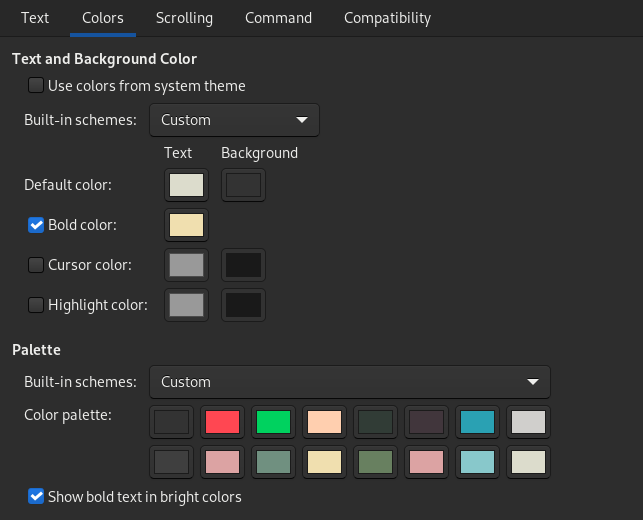

# zenburn-gnome-terminal

The Zenburn colourscheme for Vim ported to GNOME Terminal.

There are some deviations from [the original Zenburn scheme](https://github.com/jnurmine/Zenburn).  E.g. made red and green bright so `git diff` output is highly visible.

## How to import

Clone this repo, or just download the `gnomeProfile.dconf` file.

Use dconf-editor, [as per this guide](https://www.baeldung.com/linux/gnome-terminal-profile-export), to import the profile from the command line.
