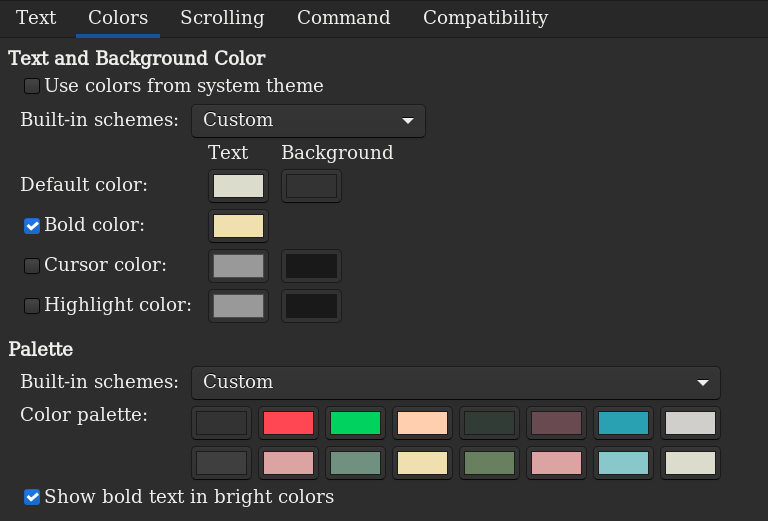

# zenburn-gnome-terminal

The Zenburn colourscheme for Vim ported to GNOME Terminal.

There are some deviations from [the original Zenburn scheme](https://github.com/jnurmine/Zenburn).  E.g. made red and green bright so `git diff` output is highly visible.

